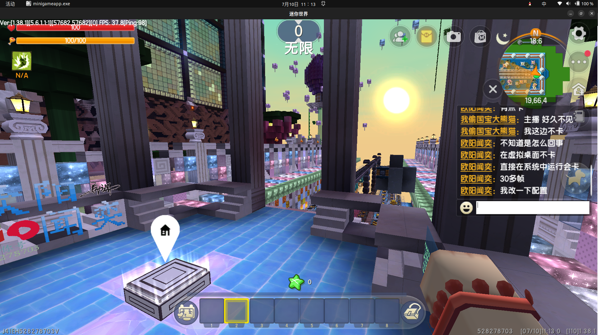

# 序言

众所周知 迷你世界是一个垃圾游戏 它不像我的世界一样 有多种系统和平台的支持

目前 迷你世界只支持**Windows** **Android** **IOS**上运行

对于使用桌面版系统的玩家 一般情况下选择的是**Windows**版本

可是 **Windows**是一个不`渍油`的系统 它是专有软件 对于我们这样追求`渍油`的用户来说 没有什么比GNU/Linux更好的选择了

像我们这样~~死性不改~~ **"热爱"垃圾游戏迷你世界** 的玩家 自然要寻找到能在Linux系统上愉快玩耍垃圾游戏的方法

# 方法

经过本喵的多次尝试 最终发现了一个宝藏 **Wine(Wine Is Not an Emulator)** 它不是模拟器

想象一下 当你费尽心思摆脱了**Windows**爆红的C盘 装上了干净的Linux系统 为了一个垃圾游戏 又要在自己电脑里塞一坨巨大无比的**Windows** VM 那种感觉要多恶心有多恶心

*本喵也是Linux新手 很多东西都要不断探索 这篇文章本来也是写给新手看的 大佬轻喷*

## 硬件配置

本喵的电脑不是很好 原先使用**Windows**系统的时候 运行垃圾游戏大概可以有400多帧

以下是本喵的电脑配置

```bash
~/awa/Blog (main*) » neofetch                                                                                                                                                                         owalabuy@awa
            .-/+oossssoo+/-.
        `:+ssssssssssssssssss+:`           owalabuy@awa 
      -+ssssssssssssssssssyyssss+-         ------------ 
    .ossssssssssssssssssdMMMNysssso.       OS: Ubuntu 22.04.4 LTS x86_64 
   /ssssssssssshdmmNNmmyNMMMMhssssss/      Host: Dell G15 5511 
  +ssssssssshmydMMMMMMMNddddyssssssss+     Kernel: 6.5.0-41-generic 
 /sssssssshNMMMyhhyyyyhmNMMMNhssssssss/    Uptime: 1 hour, 16 mins 
.ssssssssdMMMNhsssssssssshNMMMdssssssss.   Packages: 2887 (dpkg), 15 (snap) 
+sssshhhyNMMNyssssssssssssyNMMMysssssss+   Shell: zsh 5.8.1 
ossyNMMMNyMMhsssssssssssssshmmmhssssssso   Resolution: 1920x1080, 1080x1920, 1920x1080 
ossyNMMMNyMMhsssssssssssssshmmmhssssssso   DE: Unity 
+sssshhhyNMMNyssssssssssssyNMMMysssssss+   WM: Mutter 
.ssssssssdMMMNhsssssssssshNMMMdssssssss.   WM Theme: Adwaita 
 /sssssssshNMMMyhhyyyyhdNMMMNhssssssss/    Theme: Yaru-purple-dark [GTK2/3] 
  +sssssssssdmydMMMMMMMMddddyssssssss+     Icons: Yaru-purple [GTK2/3] 
   /ssssssssssshdmNNNNmyNMMMMhssssss/      Terminal: vscode 
    .ossssssssssssssssssdMMMNysssso.       CPU: 11th Gen Intel i5-11260H (12) @ 4.400GHz 
      -+sssssssssssssssssyyyssss+-         GPU: Intel TigerLake-H GT1 [UHD Graphics] 
        `:+ssssssssssssssssss+:`           GPU: NVIDIA GeForce RTX 3050 Mobile 
            .-/+oossssoo+/-.               Memory: 7937MiB / 15715MiB 
```

现在我玩垃圾游戏大概可以到70帧左右 基本没有卡顿的感觉 还是比较满意的 可以玩生存 跑酷 还有做地图之类的

## 安装步骤

### 安装wine

如果你用的是Debian系的Linux 可以直接通过APT安装wine

```bash
sudo apt install wine
```
如果你用的是其他发行版的系统 可以使用当前系统的方法安装wine

### 配置wine

在终端输入`winecfg` 会打开一个页面 按照下面的步骤进行设置

1. 在**应用程序**标签下 将Windows版本设为Windows 7
2. 在**函数库**标签下 新增dinput 和xinput1_3 将它们编辑为 内建
3. 在**显示**标签下 将窗口设置下 除了全屏模式下自动捕获光标之外 全部勾选上 并把虚拟桌面的大小设为1808\*1017 或者任意一个你喜欢的16:9的分辨率 但是最好不要设为1920*1080 占满屏幕可能会导致一些问题

### 下载游戏安装器

在迷你官网下载桌面版的可执行文件

### 运行游戏

cd进入下载游戏的那个目录 

用wine运行那个可执行文件

```bash
wine miniworldoffice.exe
```

它会弹出一个虚拟桌面 开始安装迷你世界

等待一段时间 进入游戏就可以登录你的账号了

### 后续如何运行

安装完游戏之后 应用菜单中应该会出现迷你世界的快捷方式 名为minigame 点击它即可启动游戏

# 问题及解决方式

## 游戏中的问题

### 无法进入地图

在本喵刚安装好迷你世界之后 出现了一个问题 点击"打开地图" 或"单人游戏"没有反应 狂点也没有用

但是这个问题在重启了几次之后就好了 没有采取什么特殊的措施 各位要是遇到了 也可以重启电脑试试

### 皮肤模型显示不全

本喵一直使用酋长夫人皮肤 模型显示不全 而且很多老皮肤的模型都有问题 本喵也没有什么办法解决 好在这个问题不会影响玩家玩游戏


## 交互问题

### 键盘断触问题

有时候 明明按下了按键 但是游戏中没有正常判定 导致玩家没有移动 这个问题会严重影响玩家的游戏体验

我们可以使用函数库顶替来解决这个问题 确保你的dinput 和 xinput1_3的载入顺序为内建

并且 不要使用F11进行全屏 而是在wine虚拟桌面中使用窗口全屏

### 输入法问题

本喵使用的是ibus的极点五笔输入法 它和游戏的兼容是有问题的 如果处于中文输入模式下 玩家按下键会打出编码 而不是移动 如果切换到英文 我们常使用的潜行跳(shift+space)会触发字符全角

但是切换到英文输入法 又不方便与人交流聊天 切换到五笔要按一次super+space 还要将窗口聚焦到wine的虚拟桌面 很恶心人

建议把潜行改键 或者在单人游戏不需要打字的时候使用英文输入法 而不是ibus之类的输入法

## 字符集问题

在游戏中打字聊天 会先输入到一个白色的框中 但是输入中文字符的时候就会出现问题 中文字符全部变成了方块 我猜这应该是字体的问题 但是游戏中使用的方正粗圆显示是没有问题的 只要记住了自己打了哪些字就好了 这个问题不影响使用

如果我以后找到了好的解决方法 会在这里说明的

# 说明

## 是否使用虚拟桌面

虚拟桌面是winecfg中的一个选项 如果启动它 它会把运行的游戏窗口放在一个虚拟的固定大小的窗口中 如果不勾选虚拟桌面 应用程序会像普通的窗口应用程序一样直接在电脑上运行

虚拟桌面有一些好处 也有一些缺点

**优点**: 稳定流畅 不会受窗口兼容性问题影响
**缺点**: 大小固定 只能在winecfg中调整 不能最大化

经过本喵测试 如果不使用虚拟桌面 窗口会比较美观 但是性能会受到很大的影响 游戏变成30多帧 体验不好 所以还是推荐大家使用虚拟桌面

图示 虚拟桌面和不使用虚拟桌面运行游戏


